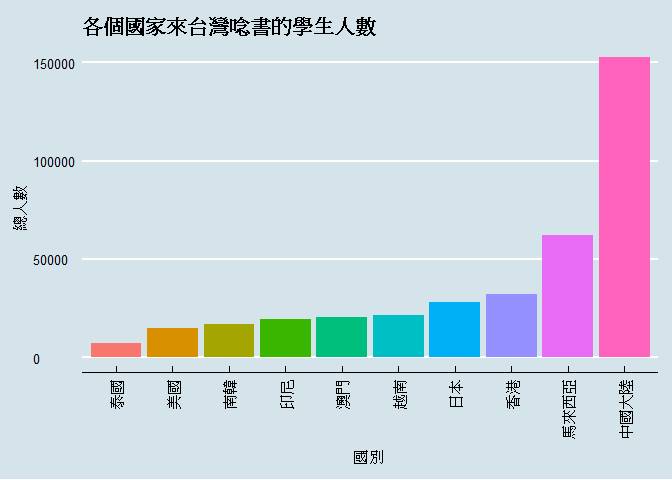
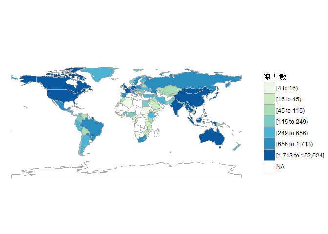
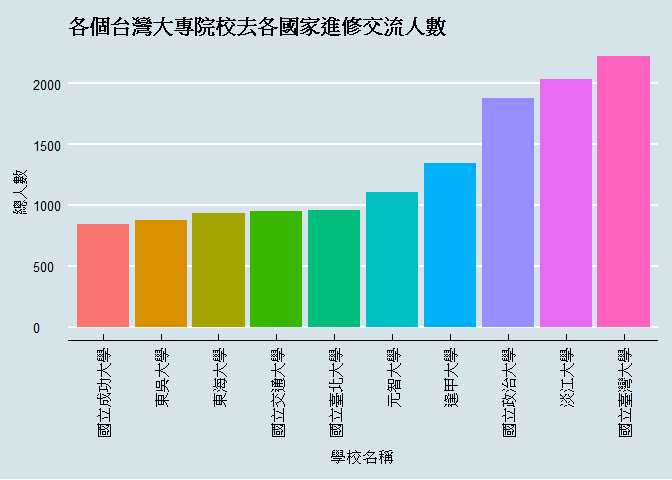
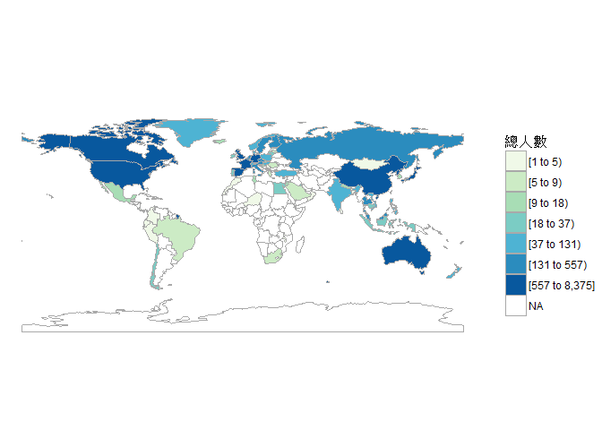
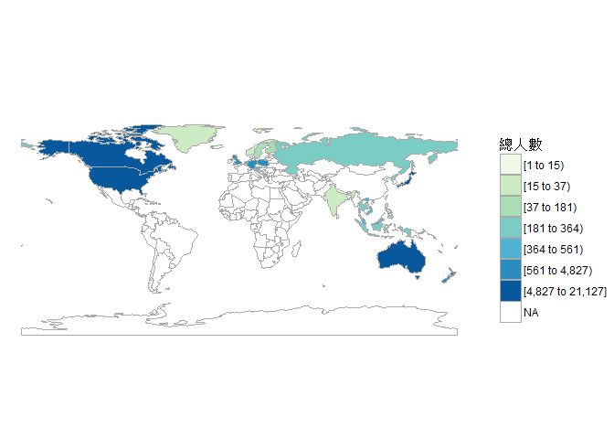
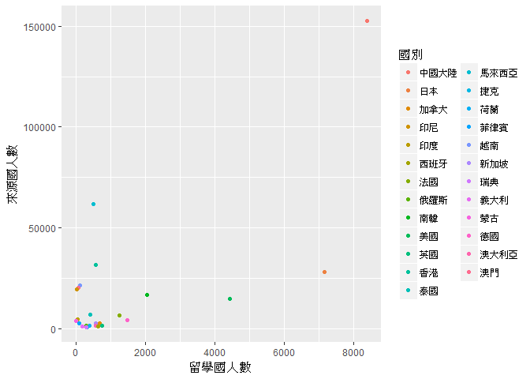

106-2 大數據分析方法 作業二
================
zhi-yu Xu

作業完整說明[連結](https://docs.google.com/document/d/1aLGSsGXhgOVgwzSg9JdaNz2qGPQJSoupDAQownkGf_I/edit?usp=sharing)

學習再也不限定在自己出生的國家，台灣每年有許多學生選擇就讀國外的大專院校，同時也有人多國外的學生來台灣就讀，透過分析[大專校院境外學生人數統計](https://data.gov.tw/dataset/6289)、[大專校院本國學生出國進修交流數](https://data.gov.tw/dataset/24730)、[世界各主要國家之我國留學生人數統計表](https://ws.moe.edu.tw/Download.ashx?u=C099358C81D4876CC7586B178A6BD6D5062C39FB76BDE7EC7685C1A3C0846BCDD2B4F4C2FE907C3E7E96F97D24487065577A728C59D4D9A4ECDFF432EA5A114C8B01E4AFECC637696DE4DAECA03BB417&n=4E402A02CE6F0B6C1B3C7E89FDA1FAD0B5DDFA6F3DA74E2DA06AE927F09433CFBC07A1910C169A1845D8EB78BD7D60D7414F74617F2A6B71DC86D17C9DA3781394EF5794EEA7363C&icon=..csv)可以了解103年以後各大專院校國際交流的情形。請同學分析以下議題，並以視覺化的方式呈現分析結果，呈現103年以後大專院校國際交流的情形。

來台境外生分析
--------------

### 資料匯入與處理

``` r
#需載入之相關套件
library(readr)
library(dplyr)
```

    ## 
    ## Attaching package: 'dplyr'

    ## The following objects are masked from 'package:stats':
    ## 
    ##     filter, lag

    ## The following objects are masked from 'package:base':
    ## 
    ##     intersect, setdiff, setequal, union

``` r
library(knitr)

C103 <- read_csv("~/GitHub/106bigdatacguimhw2-paperfish/103_ab103_C.csv")
```

    ## Parsed with column specification:
    ## cols(
    ##   洲別 = col_character(),
    ##   國別 = col_character(),
    ##   `學位生-正式修讀學位外國生` = col_integer(),
    ##   `學位生-僑生(含港澳)` = col_integer(),
    ##   `學位生-正式修讀學位陸生` = col_integer(),
    ##   `非學位生-外國交換生` = col_integer(),
    ##   `非學位生-外國短期研習及個人選讀` = col_integer(),
    ##   `非學位生-大專附設華語文中心學生` = col_integer(),
    ##   `非學位生-大陸研修生` = col_integer(),
    ##   `非學位生-海青班` = col_integer(),
    ##   境外專班 = col_integer()
    ## )

``` r
C104 <- read_csv("~/GitHub/106bigdatacguimhw2-paperfish/104_ab104_C.csv")
```

    ## Parsed with column specification:
    ## cols(
    ##   洲別 = col_character(),
    ##   國別 = col_character(),
    ##   `學位生-正式修讀學位外國生` = col_integer(),
    ##   `學位生-僑生(含港澳)` = col_integer(),
    ##   `學位生-正式修讀學位陸生` = col_integer(),
    ##   `非學位生-外國交換生` = col_integer(),
    ##   `非學位生-外國短期研習及個人選讀` = col_integer(),
    ##   `非學位生-大專附設華語文中心學生` = col_integer(),
    ##   `非學位生-大陸研修生` = col_integer(),
    ##   `非學位生-海青班` = col_integer(),
    ##   境外專班 = col_integer()
    ## )

``` r
C105 <- read_csv("~/GitHub/106bigdatacguimhw2-paperfish/105_ab105_C.csv")
```

    ## Parsed with column specification:
    ## cols(
    ##   洲別 = col_character(),
    ##   國別 = col_character(),
    ##   學位生_正式修讀學位外國生 = col_integer(),
    ##   `學位生_僑生(含港澳)` = col_integer(),
    ##   學位生_正式修讀學位陸生 = col_integer(),
    ##   非學位生_外國交換生 = col_integer(),
    ##   非學位生_外國短期研習及個人選讀 = col_integer(),
    ##   非學位生_大專附設華語文中心學生 = col_integer(),
    ##   非學位生_大陸研修生 = col_integer(),
    ##   非學位生_海青班 = col_integer(),
    ##   境外專班 = col_integer()
    ## )

``` r
C106 <- read_csv("~/GitHub/106bigdatacguimhw2-paperfish/106_ab105_C.csv")
```

    ## Parsed with column specification:
    ## cols(
    ##   洲別 = col_character(),
    ##   國別 = col_character(),
    ##   學位生_正式修讀學位外國生 = col_integer(),
    ##   `學位生_僑生(含港澳)` = col_integer(),
    ##   學位生_正式修讀學位陸生 = col_integer(),
    ##   非學位生_外國交換生 = col_integer(),
    ##   非學位生_外國短期研習及個人選讀 = col_integer(),
    ##   非學位生_大專附設華語文中心學生 = col_integer(),
    ##   非學位生_大陸研修生 = col_integer(),
    ##   非學位生_海青班 = col_integer(),
    ##   境外專班 = col_integer()
    ## )

``` r
#新增一欄位將每一年度所有來台念書的學生作加總
C103$total<-rowSums(C103[,3:11],na.rm = T)
C104$total<-rowSums(C104[,3:11],na.rm = T)
C105$total<-rowSums(C105[,3:11],na.rm = T)
C106$total<-rowSums(C106[,3:11],na.rm = T)
#將103、104、105、106年度合併為一表，並重新命名其欄位名稱
CStudent<-merge(select(C103,"國別",total),
                select(C104,"國別",total),
                by = "國別",all=T)
CStudent<-merge(CStudent,
                select(C105,"國別",total),
                by = "國別",all=T)
CStudent<-merge(CStudent,
                select(C106,"國別",total),
                by = "國別",all=T)
```

    ## Warning in merge.data.frame(CStudent, select(C106, "國別", total), by = "國
    ## 別", : column names 'total.x', 'total.y' are duplicated in the result

``` r
names(CStudent)<-c("國別","total103","total104","total105","total106")

S103<- read_csv("~/GitHub/106bigdatacguimhw2-paperfish/103_ab103_S.csv")
```

    ## Parsed with column specification:
    ## cols(
    ##   學校類型 = col_character(),
    ##   學校代碼 = col_character(),
    ##   學校名稱 = col_character(),
    ##   `學位生-正式修讀學位外國生` = col_integer(),
    ##   `學位生-僑生(含港澳)` = col_integer(),
    ##   `學位生-正式修讀學位陸生` = col_integer(),
    ##   `非學位生-外國交換生` = col_integer(),
    ##   `非學位生-外國短期研習及個人選讀` = col_integer(),
    ##   `非學位生-大專附設華語文中心學生` = col_integer(),
    ##   `非學位生-大陸研修生` = col_character(),
    ##   `非學位生-海青班` = col_integer(),
    ##   境外專班 = col_integer()
    ## )

``` r
S104<- read_csv("~/GitHub/106bigdatacguimhw2-paperfish/104_ab104_S.csv")
```

    ## Parsed with column specification:
    ## cols(
    ##   學校類型 = col_character(),
    ##   學校代碼 = col_character(),
    ##   學校名稱 = col_character(),
    ##   `學位生-正式修讀學位外國生` = col_integer(),
    ##   `學位生-僑生(含港澳)` = col_integer(),
    ##   `學位生-正式修讀學位陸生` = col_integer(),
    ##   `非學位生-外國交換生` = col_integer(),
    ##   `非學位生-外國短期研習及個人選讀` = col_integer(),
    ##   `非學位生-大專附設華語文中心學生` = col_integer(),
    ##   `非學位生-大陸研修生` = col_character(),
    ##   `非學位生-海青班` = col_integer(),
    ##   境外專班 = col_integer()
    ## )

``` r
S105<- read_csv("~/GitHub/106bigdatacguimhw2-paperfish/105_ab105_S.csv")
```

    ## Parsed with column specification:
    ## cols(
    ##   學校類型 = col_character(),
    ##   學校代碼 = col_character(),
    ##   學校名稱 = col_character(),
    ##   學位生_正式修讀學位外國生 = col_integer(),
    ##   `學位生_僑生(含港澳)` = col_integer(),
    ##   學位生_正式修讀學位陸生 = col_integer(),
    ##   非學位生_外國交換生 = col_integer(),
    ##   非學位生_外國短期研習及個人選讀 = col_integer(),
    ##   非學位生_大專附設華語文中心學生 = col_integer(),
    ##   非學位生_大陸研修生 = col_integer(),
    ##   非學位生_海青班 = col_integer(),
    ##   境外專班 = col_integer()
    ## )

``` r
S106<- read_csv("~/GitHub/106bigdatacguimhw2-paperfish/106_ab105_S.csv")
```

    ## Parsed with column specification:
    ## cols(
    ##   學校類型 = col_character(),
    ##   學校代碼 = col_character(),
    ##   學校名稱 = col_character(),
    ##   學位生_正式修讀學位外國生 = col_integer(),
    ##   `學位生_僑生(含港澳)` = col_integer(),
    ##   學位生_正式修讀學位陸生 = col_integer(),
    ##   非學位生_外國交換生 = col_integer(),
    ##   非學位生_外國短期研習及個人選讀 = col_integer(),
    ##   非學位生_大專附設華語文中心學生 = col_integer(),
    ##   非學位生_大陸研修生 = col_integer(),
    ##   非學位生_海青班 = col_integer(),
    ##   境外專班 = col_integer()
    ## )

``` r
#將`非學位生-大陸研修生`此欄位轉成數值，並將不是數值的東西轉成NA
S103$`非學位生-大陸研修生`<-as.numeric(gsub("…",NA,S103$`非學位生-大陸研修生`))
S104$`非學位生-大陸研修生`<-as.numeric(gsub("…",NA,S104$`非學位生-大陸研修生`))
#新增一欄位將每一年度所有學校出國念書的學生作加總
S103$total<-rowSums(S103[,4:12],na.rm = T)
S104$total<-rowSums(S104[,4:12],na.rm = T)
S105$total<-rowSums(S105[,4:12],na.rm = T)
S106$total<-rowSums(S106[,4:12],na.rm = T)
#將103、104、105、106年度合併為一表，並重新命名其欄位名稱
SStudent<-merge(select(S103,"學校名稱",total),
                select(S104,"學校名稱",total),
                by = "學校名稱")
SStudent<-merge(SStudent,
                select(S105,"學校名稱",total),
                by = "學校名稱")
SStudent<-merge(SStudent,
                select(S106,"學校名稱",total),
                by = "學校名稱")
```

    ## Warning in merge.data.frame(SStudent, select(S106, "學校名稱", total), by =
    ## "學校名稱"): column names 'total.x', 'total.y' are duplicated in the result

``` r
names(SStudent)<-c("學校名稱","total103","total104","total105","total106")

Compare <- read_csv("~/GitHub/106bigdatacguimhw2-paperfish/CountriesComparisionTable.csv")
```

    ## Parsed with column specification:
    ## cols(
    ##   ISO3 = col_character(),
    ##   English = col_character(),
    ##   Taiwan = col_character()
    ## )

``` r
names(Compare)<-c("ISO3","English","國別")
```

### 哪些國家來台灣唸書的學生最多呢？

``` r
#新增一欄位"總人數"將每一年度的和做加總，為103-106年度為止來台念書的總人數，並從多到少排序
library(dplyr)
CStudent<-CStudent%>%
  mutate(總人數 =rowSums(CStudent[,2:5]))%>%
  select(國別,總人數)%>%
  arrange(desc(總人數))

CStudent10<-head(CStudent,10)
CStudent10$國別 <- factor(CStudent10$國別, 
                        levels = CStudent10$國別[order(CStudent10$總人數)])
kable(CStudent10)
```

| 國別     | 總人數 |
|:---------|:------:|
| 中國大陸 | 152524 |
| 馬來西亞 |  62031 |
| 香港     |  31940 |
| 日本     |  28200 |
| 越南     |  21670 |
| 澳門     |  20302 |
| 印尼     |  19620 |
| 南韓     |  16948 |
| 美國     |  14846 |
| 泰國     |  7035  |

### 哪間大學的境外生最多呢？

``` r
#新增一欄位"總人數"將每一年度的和做加總，為103-106年度為止所有學校出國念書的總人數，並從多到少排序
SStudent<-SStudent%>%
  mutate(總人數=rowSums(SStudent[,2:5]))%>%
  select(學校名稱,總人數)%>%
  arrange(desc(總人數))

kable(head(SStudent,10))
```

| 學校名稱         | 總人數 |
|:-----------------|:------:|
| 國立臺灣師範大學 |  22113 |
| 國立臺灣大學     |  18199 |
| 中國文化大學     |  16074 |
| 銘傳大學         |  16057 |
| 淡江大學         |  13887 |
| 國立政治大學     |  11626 |
| 國立成功大學     |  10982 |
| 輔仁大學         |  9499  |
| 逢甲大學         |  9474  |
| 中原大學         |  7662  |

依上表所呈現，境外生較多的學校也並非一定是國立大學較多，選擇私立大學的境外生也不少，而國立大學之中以國立臺灣師範大學為最多境外生所選擇，私立大學則是中國文化大學。 \#\#\# 各個國家來台灣唸書的學生人數條狀圖

``` r
library(ggplot2)
library(ggthemes)
ggplot()+
  geom_bar(data=CStudent10,
           aes(x=國別,y=總人數,fill = 國別),
           stat = "identity") +
  labs(title = "各個國家來台灣唸書的學生人數")+
  geom_label(position = position_stack(vjust = 0.5),
             size = 2.3,
             colour = 'black')+
  guides(fill = F)+
  theme_economist()+
  theme(axis.text.x = element_text(angle = 90, hjust = 1,vjust = 0.5))
```



依上表所呈現，中國大陸為來台念書學生最多的國家，可能推翻「陸生拒來台念大學」此一說法，而馬來西亞成為第二多之國家，原因可能為政府推行新南進政策。

### 各個國家來台灣唸書的學生人數面量圖

``` r
library(choroplethr)
```

    ## Loading required package: acs

    ## Loading required package: stringr

    ## Loading required package: XML

    ## 
    ## Attaching package: 'acs'

    ## The following object is masked from 'package:dplyr':
    ## 
    ##     combine

    ## The following object is masked from 'package:base':
    ## 
    ##     apply

``` r
CCompare<-merge(CStudent,Compare,by = "國別")
df = data.frame(region=CCompare$English, value=CCompare$總人數)
df<-df[!duplicated(df$region), ]
country_choropleth(df)+ 
  scale_fill_brewer(name="總人數", palette=4, na.value="white")
```

    ## Warning in super$initialize(country.map, user.df): Your data.frame contains
    ## the following regions which are not mappable: Unmatch, Singapore

    ## Warning: Column `region` joining character vector and factor, coercing into
    ## character vector

    ## Warning in self$bind(): The following regions were missing and are being
    ## set to NA: afghanistan, angola, moldova, madagascar, mali, montenegro,
    ## mauritania, burundi, niger, oman, qatar, western sahara, sierra leone,
    ## somaliland, somalia, suriname, chad, togo, east timor, trinidad and tobago,
    ## taiwan, the bahamas, vanuatu, zambia, albania, botswana, central african
    ## republic, democratic republic of the congo, northern cyprus, cyprus,
    ## djibouti, eritrea, gabon, georgia, ghana, antarctica, guinea, guinea
    ## bissau, equatorial guinea, guyana, jamaica, south korea, kosovo, lebanon,
    ## liberia, libya, lesotho

    ## Scale for 'fill' is already present. Adding another scale for 'fill',
    ## which will replace the existing scale.



台灣學生國際交流分析
--------------------

### 資料匯入與處理

``` r
library(readxl)
library(dplyr)
TWstudent<- read_excel("~/GitHub/106bigdatacguimhw2-paperfish/Student_RPT_07.xlsx")
```

### 台灣大專院校的學生最喜歡去哪些國家進修交流呢？

``` r
TCstudent<-TWstudent%>%
  filter(學年度>=103)%>%
  group_by(`對方學校(機構)國別(地區)`)%>%
  summarise(總人數=sum(小計))%>%
  arrange(desc(總人數))

kable(head(TCstudent,10))
```

| 對方學校(機構)國別(地區) | 總人數 |
|:-------------------------|:------:|
| 中國大陸                 |  8375  |
| 日本                     |  7142  |
| 美國                     |  4427  |
| 南韓                     |  2050  |
| 大陸地區                 |  1516  |
| 德國                     |  1466  |
| 法國                     |  1258  |
| 英國                     |   742  |
| 加拿大                   |   689  |
| 西班牙                   |   642  |

### 哪間大學的出國交流學生數最多呢？

``` r
TSstudent<-TWstudent%>%
  filter(學年度>=103)%>%
  group_by(學校名稱)%>%
  summarise(總人數=sum(小計))%>%
  arrange(desc(總人數))

TSstudent10<-head(TSstudent,10)
TSstudent10$學校名稱 <- factor(TSstudent10$學校名稱,
                           levels =TSstudent10$學校名稱[order(TSstudent10$總人數)])

kable(TSstudent10)
```

| 學校名稱     | 總人數 |
|:-------------|:------:|
| 國立臺灣大學 |  2224  |
| 淡江大學     |  2038  |
| 國立政治大學 |  1876  |
| 逢甲大學     |  1346  |
| 元智大學     |  1106  |
| 國立臺北大學 |   956  |
| 國立交通大學 |   951  |
| 東海大學     |   931  |
| 東吳大學     |   873  |
| 國立成功大學 |   846  |

依上表所呈現，國立臺灣大學的出國交流學生數最多，可能成績越好的學生可能比較會利用學校的資源來增加到國外交流的經驗，可能也會外語能力比較好的學生也會比較想到國外去測試自己的實力如何。

### 台灣大專院校的學生最喜歡去哪些國家進修交流條狀圖

``` r
ggplot()+
  geom_bar(data=TSstudent10,
                  aes(x=學校名稱,y=總人數,fill =學校名稱),
                  stat = "identity")+
  labs(title = "各個台灣大專院校去各國家進修交流人數")+
  geom_label(position = position_stack(vjust = 0.5),
             size = 2.3,
             colour = 'black')+
  guides(fill = F)+
  theme_economist()+
  theme(axis.text.x = element_text(angle = 90, hjust = 1,vjust = 0.5))
```



依上表所呈現，中國大陸為台灣大專院校的學生最喜歡去的國家，證實根據北京清華大學的統計指出，近三年來，台生申請人數不斷翻倍成長，原因為學費便宜、獎學金豐富、打算到中國工作、港澳台優惠政策更有機會唸到好大學、國際排名高、語言相通，而日本美國也是常年學生票選最愛去國家的榜上名單。

### 台灣大專院校的學生最喜歡去哪些國家進修交流面量圖

``` r
names(TCstudent)<-c("國別","總人數")
TCompare<-merge(TCstudent,Compare,by = "國別")
df = data.frame(region=TCompare$English, value=TCompare$總人數)
df<-df[!duplicated(df$region), ]
country_choropleth(df)+ 
  scale_fill_brewer(name="總人數", palette=4, na.value="white")
```

    ## Warning in super$initialize(country.map, user.df): Your data.frame contains
    ## the following regions which are not mappable: Unmatch, Singapore

    ## Warning: Column `region` joining character vector and factor, coercing into
    ## character vector

    ## Warning in self$bind(): The following regions were missing and are being
    ## set to NA: afghanistan, angola, azerbaijan, moldova, madagascar, macedonia,
    ## mali, myanmar, montenegro, mozambique, mauritania, burundi, namibia,
    ## nigeria, nicaragua, pakistan, papua new guinea, benin, paraguay, rwanda,
    ## western sahara, sudan, burkina faso, south sudan, senegal, sierra leone,
    ## el salvador, somaliland, somalia, suriname, syria, chad, togo, tajikistan,
    ## turkmenistan, east timor, bulgaria, trinidad and tobago, taiwan, united
    ## republic of tanzania, uganda, ukraine, uruguay, uzbekistan, the bahamas,
    ## venezuela, vanuatu, yemen, zambia, zimbabwe, bosnia and herzegovina,
    ## belarus, albania, belize, bolivia, bhutan, botswana, central african
    ## republic, united arab emirates, ivory coast, cameroon, democratic republic
    ## of the congo, republic of congo, cuba, northern cyprus, cyprus, argentina,
    ## djibouti, dominican republic, algeria, eritrea, armenia, ethiopia,
    ## fiji, gabon, georgia, ghana, antarctica, guinea, gambia, guinea bissau,
    ## equatorial guinea, guatemala, guyana, honduras, haiti, iran, iraq, jamaica,
    ## kazakhstan, kenya, kyrgyzstan, kosovo, laos, lebanon, liberia, libya,
    ## lesotho, luxembourg

    ## Scale for 'fill' is already present. Adding another scale for 'fill',
    ## which will replace the existing scale.



台灣學生出國留學分析
--------------------

### 資料匯入與處理

``` r
twc<- read_csv("~/GitHub/106bigdatacguimhw2-paperfish/105fuck.csv")
```

    ## Warning: Missing column names filled in: 'X4' [4], 'X5' [5], 'X6' [6]

    ## Parsed with column specification:
    ## cols(
    ##   洲別 = col_character(),
    ##   國別 = col_character(),
    ##   總人數 = col_number(),
    ##   X4 = col_character(),
    ##   X5 = col_character(),
    ##   X6 = col_character()
    ## )

``` r
twc[,4:6]<-NULL
```

### 台灣學生最喜歡去哪些國家留學呢？

``` r
twc<-twc%>%
  select("國別","總人數")%>%
  arrange(desc(總人數))

kable(head(twc,10))
```

| 國別     | 總人數 |
|:---------|:------:|
| 美國     |  21127 |
| 澳大利亞 |  13582 |
| 日本     |  8444  |
| 加拿大   |  4827  |
| 英國     |  3815  |
| 德國     |  1488  |
| 紐西蘭   |  1106  |
| 波蘭     |   561  |
| 馬來西亞 |   502  |
| 奧地利   |   419  |

### 台灣學生最喜歡去哪些國家留學面量圖

``` r
TwcCompare<-merge(twc,Compare,by = "國別")
df = data.frame(region=TwcCompare$English, value=TwcCompare$總人數)
df<-df[!duplicated(df$region), ]
country_choropleth(df)+ 
  scale_fill_brewer(name="總人數", palette=4, na.value="white")
```

    ## Warning in super$initialize(country.map, user.df): Your data.frame contains
    ## the following regions which are not mappable: Singapore

    ## Warning: Column `region` joining character vector and factor, coercing into
    ## character vector

    ## Warning in self$bind(): The following regions were missing and are being
    ## set to NA: afghanistan, angola, azerbaijan, moldova, madagascar, mexico,
    ## macedonia, mali, myanmar, montenegro, mongolia, mozambique, mauritania,
    ## burundi, malawi, namibia, france, niger, nigeria, nicaragua, oman,
    ## pakistan, panama, peru, papua new guinea, benin, portugal, paraguay,
    ## israel, qatar, romania, rwanda, western sahara, saudi arabia, sudan,
    ## burkina faso, south sudan, senegal, solomon islands, sierra leone, el
    ## salvador, somaliland, somalia, republic of serbia, suriname, slovakia,
    ## slovenia, swaziland, syria, chad, togo, tajikistan, turkmenistan, east
    ## timor, bulgaria, trinidad and tobago, tunisia, turkey, taiwan, united
    ## republic of tanzania, uganda, ukraine, uruguay, uzbekistan, the bahamas,
    ## venezuela, vanuatu, yemen, south africa, zambia, zimbabwe, bosnia and
    ## herzegovina, belarus, albania, belize, bolivia, brazil, bhutan, botswana,
    ## central african republic, switzerland, chile, united arab emirates, china,
    ## ivory coast, cameroon, democratic republic of the congo, republic of
    ## congo, colombia, costa rica, cuba, northern cyprus, cyprus, argentina,
    ## czech republic, djibouti, dominican republic, algeria, ecuador, egypt,
    ## eritrea, spain, armenia, estonia, ethiopia, fiji, gabon, georgia, ghana,
    ## antarctica, guinea, gambia, guinea bissau, equatorial guinea, greece,
    ## guatemala, guyana, honduras, croatia, haiti, hungary, ireland, iran, iraq,
    ## italy, jamaica, jordan, kazakhstan, kenya, kyrgyzstan, cambodia, south
    ## korea, kosovo, kuwait, laos, lebanon, liberia, libya, lesotho, lithuania,
    ## luxembourg, latvia, morocco

    ## Scale for 'fill' is already present. Adding another scale for 'fill',
    ## which will replace the existing scale.



大部分台灣學生喜歡去的國家多為歐美國家，就像是東方人對西方世界的一種憧憬一樣，而澳大利亞擠身為第二名，也可能是因為西方文化再加上在澳洲打工賺很多一說，也可能成為許多人夢想留學的國家。

綜合分析
--------

請問來台讀書與離台讀書的來源國與留學國趨勢是否相同(5分)？

想來台灣唸書的境外生，他們的母國也有很多台籍生嗎？請圖文並茂說明你的觀察(10分)。

``` r
library(ggplot2)
names(CStudent)<-c("國別","來源國人數")
names(TCstudent)<-c("國別","留學國人數")
a<-merge(CStudent,TCstudent,by = "國別")
a<-a%>%
  arrange(desc(來源國人數+留學國人數))%>%
  head(25)
ggplot(a, 
       aes(x =留學國人數, 
           y =來源國人數,
           color=國別)) + 
  geom_point()
```



除了中國大陸以外的國家，均沒有明顯趨勢來證明來源國與留學國為正相關或負相關，但有些許國家為來源國明顯大於留學國人數，也有些許國家為留學國明顯大於來源國人數。

依散布圖來看，似乎離台灣本島較近的國家，像是中國大陸、日本、南韓...，這些國家會偏向台灣去該國留學的人數比較多。
